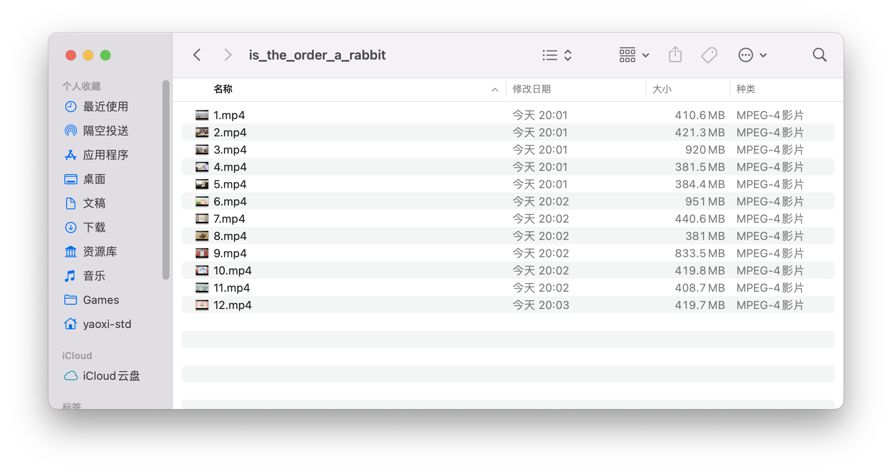

# Bilibili 番剧下载器

这是一个用 python3 实现的小脚本，用于一键从b站上下载一整部番剧。

## 使用方法

首先保证 `python3`，`axel` 以及 `ffmpeg` 可以正常使用。

取出你在b站的 Cookie，复制到与 `main.py` 同目录下的 `cookie.txt` 中。

然后直接运行 `main.py`（你可能需要在 Windows 下用 python 打开它）。输入番剧的网址和储存的文件夹，程序会自动下载对应的 `.flv` 以及 `.ogg` 并合并为 `.mp4`。你可以选择是否在合成 `.mp4` 后保留 `.flv` 和 `.ogg`。

## 使用示例

下载链接可以是 番剧链接 和 视频链接 的 **任意一种**。例如:
- `https://www.bilibili.com/bangumi/media/md191`
- `https://www.bilibili.com/bangumi/play/ep95847?from_spmid=666.19.0.0`

```sh
$ /usr/bin/python3 "/Users/yaoxi-std/Documents/project/bilibili-bangumi-downloader/main.py"
Video URL: https://www.bilibili.com/bangumi/media/md191
Download to: ~/Downloads/is_the_order_a_rabbit
Clean .flv/.ogg in download directory? [Y/n] (default n): Y
...
```

## 下载结果


